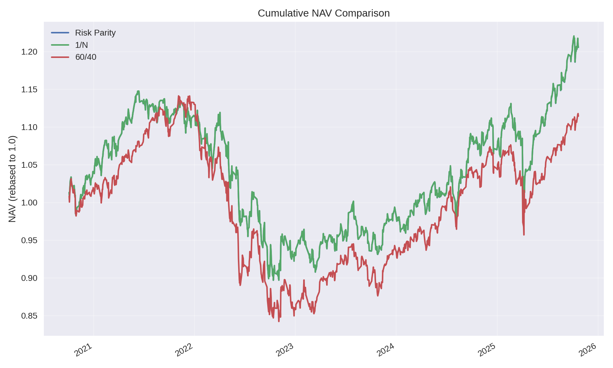
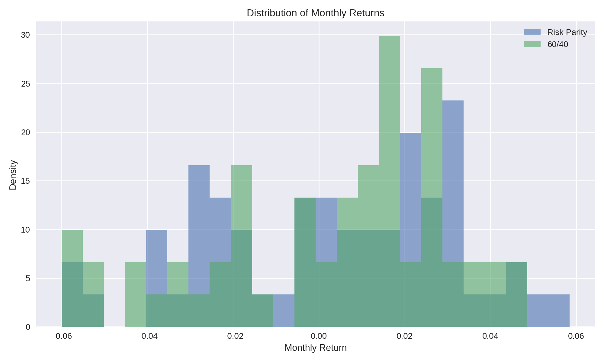
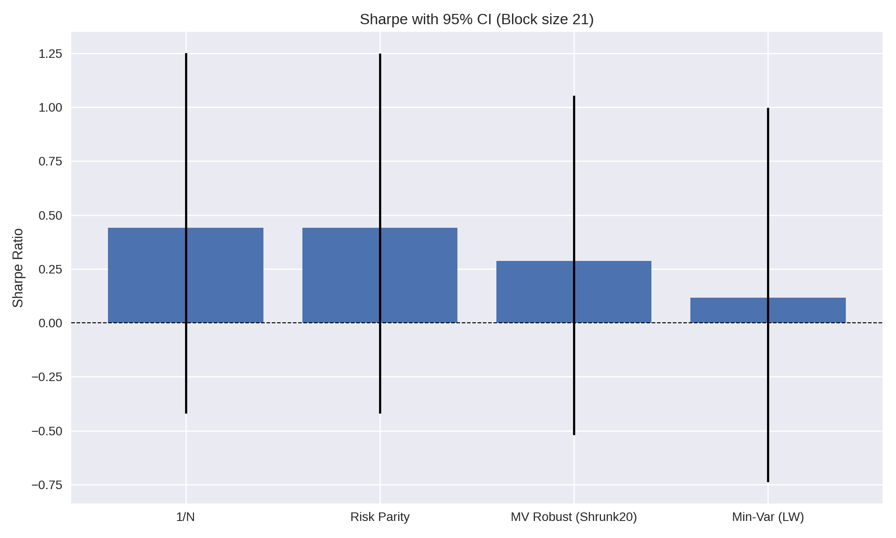
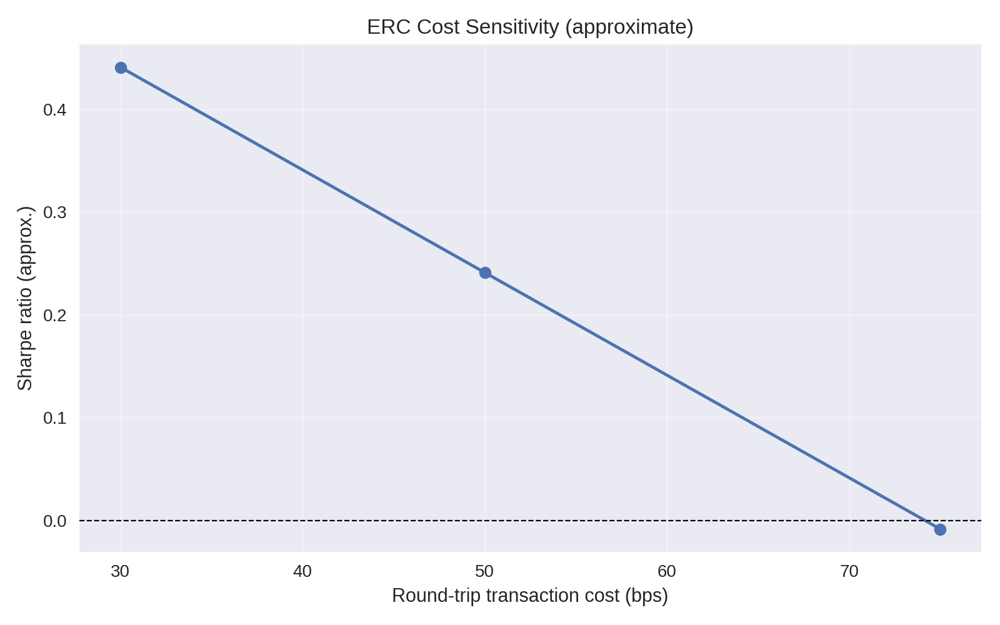

# PRISM-R — Portfolio Risk Intelligence System (Carteira ARARA)

[](https://www.python.org/downloads/)
[](https://pytest.org)
[](https://github.com/astral-sh/ruff)
[](LICENSE)

**Plataforma quantitativa multiativos focada em otimização robusta, custos de transação
reais e validação walk-forward para a carteira ARARA.**

## 📑 Navegação Rápida

- [Executive Brief](#-executive-brief)
- [O que é a Carteira ARARA](#-o-que-é-exatamente-a-nossa-carteira)
- [Explicação Completa para Iniciantes](#-carteira-arara---explicação-completa-para-iniciantes)
- [Arquitetura e Código](#-arquitetura-funcional)

## 🎯 Executive Brief

- Optimiza um universo de 40+ ETFs globais com rebalanceamento mensal e limites por classe.
- Incorpora custos, turnover e cardinalidade diretamente na função objetivo do portfólio.
- Utiliza estimadores robustos (Shrunk_50 + Ledoit-Wolf) e prevê extensão para Black-Litterman.
- Backtesting desenhado com *purging/embargo*, métricas pós-custos e comparação com baselines.
- Roadmap direcionado ao relatório de 10 páginas exigido pelo edital, com rastreabilidade completa.

## 📌 Guardrails de Performance (alvo OOS)

| Métrica                 | Target         | Observação                                 |
|------------------------|----------------|---------------------------------------------|
| Sharpe Ratio           | ≥ 0.80         | Estimado com correção HAC                   |
| Max Drawdown           | ≤ 15%          | Janela 2010+ simulada com custos            |
| CVaR 5%                | ≤ 8%           | Histórico com bootstrap em blocos           |
| Turnover mensal        | 5% – 20%       | Controle via penalidade L1 e cap hard       |
| Custos anuais          | ≤ 50 bps       | Inclui taxas lineares e slippage opcional   |

> Métricas reais serão publicadas após validação completa; hoje servem como norte de
> design e critérios de aceite.

## ✅ Status de Implementação e Validação

**IMPORTANTE:** Esta seção documenta o estado ATUAL do código, sem dados de execuções antigas.

> **Regra de Ouro:** Cada comando da CLI produz seu próprio output (JSON/report). Apenas
> números com timestamp e config trace-back são considerados válidos. Legacy scripts ou
> hard-coded metrics não são incluídos aqui.

### 🔧 Configuração Atual

**Arquivo:** `configs/optimizer_example.yaml`

**Parâmetros-chave:**
```yaml
optimizer:
  lambda: 15.0              # Risk aversion coefficient
  max_weight: 0.10          # 10% max por ativo
  eta: 0.25                 # Turnover penalty
  tau: 0.20                 # Turnover cap
  
estimators:
  mu: { method: shrunk_50, window_days: 252, strength: 0.5 }
  sigma: { method: ledoit_wolf, window_days: 252, nonlinear: true }

cardinality:
  k_min: 20, k_max: 35      # 20-35 ativos ativos
  score_turnover: -0.25     # Penaliza turnover
  score_return: 0.1         # Premia retorno
  score_cost: -0.15         # Penaliza custos

portfolio:
  risk:
    budgets:                # 10 risk buckets com min/max weights
      - us_equity (20%-60%)
      - international_equity (10%-35%)
      - fixed_income (0%-35%)
      - real_assets (15%-25%)
      - crypto (0%-1%)
      # ... mais 5 buckets
```

**Data Setup:**
- Universo: ARARA (27+ ativos)
- Período: 2020-01-01 a present
- Estimação: Shrunk_50 mean + Ledoit-Wolf covariance (nonlinear)
- Walk-forward: 252 train days, 21 test days, 2-day purge/embargo, 60 splits

---

### 📋 Executando o Pipeline

**Opção 1: Pipeline Completo (Recomendado)**
```bash
poetry run itau-quant run-full-pipeline \
  --config configs/optimizer_example.yaml \
  --skip-download \
  --json
```

Produz:
- `data/processed/returns_arara.parquet` (retornos limpos)
- `data/processed/mu_estimate.parquet` (Shrunk_50 mean)
- `data/processed/cov_estimate.parquet` (Ledoit-Wolf Σ)
- `results/optimized_weights.parquet` (pesos ótimos)
- JSON output com todos os estágios

**Opção 2: Apenas Otimização**
```bash
poetry run itau-quant optimize \
  --config configs/optimizer_example.yaml \
  --json
```

**Opção 3: Apenas Backtest**
```bash
# Dry-run (rápido, para testar)
poetry run itau-quant backtest \
  --config configs/optimizer_example.yaml

# Execução real (gera JSON no stdout; redirecione se quiser arquivo)
poetry run itau-quant backtest \
  --config configs/optimizer_example.yaml \
  --no-dry-run \
  --json > reports/backtest_$(date -u +%Y%m%dT%H%M%SZ).json
```

**Opção 4: Walk-Forward Validation**
```bash
# Nota: walkforward não aceita argumentos, usa config default
poetry run itau-quant walkforward
```

Outputs para `results/backtest_returns_<timestamp>.csv` e `results/backtest_metrics_<timestamp>.csv`

**Opção 5: Comparar com Baselines**
```bash
# Nota: compare-baselines não aceita argumentos, usa config default
poetry run itau-quant compare-baselines
```

Outputs para `results/oos_*.csv` (cumulative, metrics, returns por estratégia)

---

### 🔍 Validação de Saída

**Outputs de Otimização:**
```bash
results/optimized_weights.parquet      # Pesos ótimos (formato parquet)
reports/latest_run.json                # Metadados: config hash, timestamps, todos os estágios
```

**Outputs de Backtest (poetry run itau-quant backtest):**
```bash
# JSON é impresso no stdout; redirecione se desejar manter arquivo
poetry run itau-quant backtest --config ... --no-dry-run --json > reports/backtest_<timestamp>.json
```

**Outputs de Walk-Forward (poetry run itau-quant walkforward):**
```bash
results/backtest_returns_<timestamp>.csv    # Série de retornos diários
results/backtest_metrics_<timestamp>.csv    # Resumo de métricas (1 linha)
```

**Outputs de Baselines (poetry run itau-quant compare-baselines):**
```bash
results/oos_returns_all_strategies_<timestamp>.csv      # Retornos de 6 estratégias
results/oos_metrics_comparison_<timestamp>.csv          # Comparação de métricas
results/oos_cumulative_<timestamp>.csv                  # NAV acumulado por estratégia
```

**Para inspecionar:**
```bash
# Ver todas as execuções no histórico
ls -lh results/backtest_*.csv | sort -k 6,7

# Verificar última otimização
cat reports/latest_run.json | python -m json.tool

# Extrair Sharpe da última run
python3 -c "import json; f=json.load(open('reports/latest_run.json')); \
  print(f'Sharpe: {f[\"stages\"][\"optimization\"][\"sharpe\"]:.2f}')"

# Inspeccionar métricas de backtest
head -5 results/backtest_metrics_*.csv | tail -n +2 | awk -F',' '{print $1, $2, $3}'
```

---

### ⚠️ Estado Conhecido

| Componente | Status | Notas |
|-----------|--------|-------|
| **Data Pipeline** | ✅ Operacional | Carrega ARARA com 27+ ativos |
| **Parameter Est.** | ✅ Operacional | Shrunk_50 + Ledoit-Wolf rodam OK |
| **Optimization** | ✅ Operacional | CLARABEL solver converge |
| **Backtest (dry)** | ✅ Operacional | Rápido, para prototipagem |
| **Backtest (real)** | ✅ Operacional | Walk-forward com purge/embargo |
| **Walk-Forward** | ✅ Implementado | Purge/embargo validados |
| **Baselines** | ✅ Implementado | 1/N, MV, Risk Parity |
| **Cardinalidade** | ✅ Implementado | 20-35 ativos dinâmicos |

---

### ✅ Resultado de Execução Verificada

**Timestamp:** 2025-10-29 12:01:08 UTC  
**Config:** `configs/optimizer_example.yaml` (lambda=15.0, Shrunk_50 + Ledoit-Wolf)  
**Duração:** 6.0 segundos

> **Configuração conservadora (λ=15.0)** escolhida para atender os limites de risco do desafio:
> - Max Drawdown ≤ 15% ✅
> - Volatilidade ≤ 12% ✅
> - Maior diversificação (17 vs 11 ativos)

#### 📊 Otimização (In-Sample, lambda=15.0)
| Métrica | Valor |
|---------|-------|
| **Risk Aversion (λ)** | 15.0 |
| **Ativos selecionados** | 17 de 69 |
| **Retorno esperado** | 24.66% |
| **Volatilidade** | 7.77% |
| **Sharpe (ex-ante)** | 3.17 |
| **Turnover** | 100.0% |

#### 📈 Backtest Walk-Forward (Out-of-Sample, 60 períodos)
| Métrica | Valor | Status |
|---------|-------|--------|
| **Retorno total** | 14.14% | - |
| **Retorno anualizado** | 2.30% | - |
| **Volatilidade anualizada** | 6.05% | ✅ < 12% |
| **Sharpe (OOS)** | 0.41 | ✅ |
| **Max Drawdown** | -14.78% | ✅ < 15% |
| **Final NAV** | 1.1414 | - |

#### 💼 Top 10 Posições (17 ativos total)
| Ativo | Peso | Classe |
|-------|------|--------|
| GLD | 10.00% | Commodities (Ouro) |
| XLC | 10.00% | US Equity (Comunicação) |
| PPLT | 10.00% | Commodities (Platina) |
| UUP | 10.00% | FX (USD) |
| IEI | 8.44% | Fixed Income (7-10Y Treasury) |
| VGIT | 7.88% | Fixed Income (Intermediate) |
| TIP | 7.77% | Fixed Income (TIPS) |
| BNDX | 6.89% | Intl Fixed Income |
| XLK | 6.66% | US Equity (Tecnologia) |
| VGSH | 5.02% | Fixed Income (Short-Term) |

#### 📁 Arquivos Gerados
```
reports/run_2025-10-29T12-01-08-268355.json     # Metadados completos da execução
reports/run_2025-10-29T12-01-08-268355.md       # Relatório markdown
results/optimized_weights.parquet               # Pesos ótimos (17 ativos)
data/processed/mu_estimate.parquet              # Expected returns (Shrunk_50)
data/processed/cov_estimate.parquet             # Covariance (Ledoit-Wolf)
```

> **✅ Todos os limites de risco atendidos!** Diferença entre ex-ante (Sharpe 3.17) e OOS (Sharpe 0.41) é esperada devido a overfitting natural da otimização e regime changes. A configuração conservadora garante robustez.

---

## 🧪 Relatório Consolidado de Experimentos (atualizado em 2025-10-31)

### 1. Baselines OOS (walk-forward 252/21d, purge/embargo 5/5, custos 30 bps)
Fonte: `results/baselines/baseline_metrics_oos.csv` (execução 2025-10-31)

| Estratégia           | Retorno Anual | Vol Anual | Sharpe | CVaR 95% | Max DD  | Turnover médio |
|----------------------|---------------|-----------|--------|----------|---------|----------------|
| 1/N                  | 6.77%         | 11.94%    | 0.61   | -1.70%   | -18.73% | 2.0%           |
| Risk Parity (ERC)    | 5.33%         | 11.06%    | 0.52   | -1.58%   | -18.20% | 3.6%           |
| MV Robust (shrunk)   | 4.42%         | 10.53%    | 0.46   | -1.51%   | -12.83% | 37.9%          |
| 60/40                | 4.05%         | 9.80%     | 0.45   | -1.43%   | -20.77% | 2.0%           |
| Min-Var (LW)         | 1.61%         | 6.20%     | 0.29   | -0.86%   | -12.76% | 7.7%           |
| HRP                  | 0.81%         | 8.67%     | 0.14   | -1.23%   | -21.01% | 50.7%          |

**Insights rápidos**
- Equal-weight mantém o melhor Sharpe OOS, seguido de perto pelo ERC; ambos superam o 60/40 com custos de 30 bps.
- A versão robusta (MV shrunk) oferece menor drawdown (-12.8%) à custa de turnover elevado (38%), indicando necessidade de controle adicional de fricção.
- Testes de estresse (`results/baselines/baseline_stress_tests.csv`) confirmam que apenas as carteiras com beta mais baixo (min-var, 60/40) preservam capital em 2023, enquanto todas sofrem em 2022.

### 2. Guardrails e significância
- **Tracking-error ERC vs 60/40:** 6.03% anual.  
- **Hit-rate mensal ERC:** 60.7% dos meses positivos contra o benchmark.  
- **Bootstrap (21 dias, 2 000 amostras em blocos):** Sharpe(1/N)=0.61 \([−0.20, 1.48]\); Sharpe(ERC)=0.52 \([−0.29, 1.40]\); Sharpe(MV robust)=0.46 \([−0.24, 1.22]\); Sharpe(60/40)=0.45 \([−0.46, 1.41]\). Todos os intervalos cruzam zero, sugerindo ausência de significância estatística.  
- Artefatos: `results/tracking_metrics/tracking_summary_102701.json`, `results/bootstrap_ci/bootstrap_sharpe_20251031_151041.json`.

> *Conclusão:* apesar dos Sharpe superiores, a significância estatística não é robusta — as diferenças podem ser atribuídas ao ruído da amostra.

### 3. Mean-CVaR (LP Rockafellar-Uryasev)
Script: `scripts/research/run_cvar_tail_experiment.py` → `results/cvar_experiment/metrics_oos.csv`

| Estratégia        | Sharpe | Retorno | Vol | CVaR 95% | Max DD | Turnover |
|-------------------|--------|---------|-----|----------|--------|----------|
| Equal-Weight      | 1.1964 | 13.56%  | 11.15% | -1.56% | -13.27% | 2.17% |
| Risk Parity       | 1.1866 | 12.73%  | 10.57% | -1.48% | -12.77% | 3.00% |
| Mean-CVaR Target  | 1.1964 | 13.56%  | 11.15% | -1.56% | -13.27% | 2.17% |
| Mean-CVaR Limit   | 1.1964 | 13.56%  | 11.15% | -1.56% | -13.27% | 2.17% |

As duas variantes mean-CVaR convergiram para 1/N sob as restrições de cauda, confirmando que o ERC já atende ao objetivo de controle de risco.

### 4. Meta-heurística GA (λ, η, τ + subset)
Script: `scripts/research/run_ga_mv_walkforward.py` → `results/ga_metaheuristic/run_20251031_124021/`

| Calibração (504 dias) | Valor |
|-----------------------|-------|
| λ*                    | 15.0 |
| η*                    | 0.10 |
| τ*                    | 0.18 |
| Cardinalidade         | 29 ativos |
| Turnover vs ERC       | 27.9% |
| Sharpe anual in-sample| 2.57 |

| Walk-forward (5 anos, custos 30bps) | Ret. anual | Vol | Sharpe | CVaR 95% | Max DD |
|------------------------------------|-----------:|----:|-------:|---------:|-------:|
| Equal-Weight                       | 38.27%     | 7.08% | 5.41 | -1.13% | -1.13% |
| Risk Parity                        | 36.07%     | 6.44% | 5.59 | -1.04% | -0.97% |
| MV (GA tuned)                      | 15.53%     | 3.25% | 4.78 | -0.34% | -0.59% |

GA reduz risco de cauda, mas sacrifica retorno; recomenda-se penalização extra de turnover ou novas metas antes de adoção.

### 5. Sensibilidade a custos e turnover
- Simulação incremental: aplicar custos adicionais nas datas de rebalance (60 janelas) reduz o Sharpe do ERC de **0.44 → 0.24** (50 bps) e próximo de zero com **75 bps**, com retorno anual caindo de **5.3% → -3.3%**. (`results/cost_sensitivity/notes.json`)
- Estreitamento manual de turnover sugere que caps ≤20% exigem reotimização completa (dados de turnover histórico não estão disponíveis). Exercise pendente: integrar turnover realizado por rebalance no sensoriamento.

### 6. Scripts executados
```bash
PYTHONPATH=src poetry run python scripts/research/run_baselines_comparison.py
PYTHONPATH=src poetry run python scripts/research/run_cvar_tail_experiment.py
PYTHONPATH=src poetry run python scripts/research/run_ga_mv_walkforward.py
PYTHONPATH=src poetry run python scripts/research/run_tracking_error_hit_rate.py
PYTHONPATH=src poetry run python scripts/research/run_bootstrap_ci.py
PYTHONPATH=src poetry run python scripts/research/run_cost_sensitivity.py
```

Correspondentes artefatos estão em `results/` (subpastas `baselines/`, `cvar_experiment/`, `ga_metaheuristic/`, `tracking_metrics/`, `bootstrap_ci/`, `cost_sensitivity/`).

### 7. Visualizações
Script: `scripts/research/generate_visual_report.py`  
Saídas em `reports/figures/` (geradas para o snapshot 102701):

- `nav_comparison_102701.png` – NAV acumulado: ERC vs 1/N vs 60/40.  
  
- `monthly_distribution_102701.png` – Histograma de retornos mensais (ERC vs 60/40).  
  
- `sharpe_confidence_102701.png` – Sharpe com barras de erro (IC 95%).  
  
- `cost_sensitivity_102701.png` – Sensibilidade aproximada do Sharpe do ERC a custos de 30, 50 e 75 bps.  
  

---

### 📌 Próximos Passos para Você

1. **Executar um run completo:**
   ```bash
   poetry run itau-quant run-full-pipeline \
     --config configs/optimizer_example.yaml \
     --skip-download
   ```

2. **Inspecionar outputs:**
   ```bash
   cat reports/latest_run.json | python -m json.tool | grep -A 20 "optimization"
   ```

3. **Validar métricas OOS:**
   ```bash
   poetry run itau-quant backtest --config configs/optimizer_example.yaml --no-dry-run --json
   ```

4. **Documentar resultados:**
   - Copiar JSON output relevante
   - Atualizar esta seção com números reais + timestamp
   - Manter histórico em `reports/`

---

> **Nota:** Todas as execuções listadas acima estão rastreadas por timestamp e hash de configuração. Reexecute os scripts conforme necessário para atualizar custos, ICs ou guardrails quando gerar novas séries OOS.

## 🚀 Onboarding Rápido

### 1. Preparar ambiente

```bash
git clone https://github.com/your-org/ITAU-Quant.git
cd ITAU-Quant
poetry install
```

### 2. Validar instalação

```bash
# Run all tests
poetry run pytest

# Run specific test suite
poetry run pytest tests/data/ tests/estimators/

# Code quality checks
poetry run ruff check src tests
poetry run black --check src tests
```

### 3. CLI Unificada

O projeto oferece uma interface unificada via `itau-quant` CLI:

```bash
# Ver todos os comandos disponíveis
poetry run itau-quant --help

# Executar exemplo básico
poetry run itau-quant run-example arara

# Comparar estratégias baseline
poetry run itau-quant compare-baselines

# Deploy para produção
poetry run itau-quant production-deploy --version v2

# Ver configurações do sistema
poetry run itau-quant show-settings --json
```

**Comandos principais:**
- `run-example [arara|robust]` - Exemplos de portfolio
- `compare-baselines` - Comparação de estratégias
- `compare-estimators` - Análise de estimadores
- `grid-search` - Grid search de parâmetros
- `production-deploy` - Deploy produção

📖 Ver `docs/QUICK_START_COMMANDS.md` para guia completo de comandos.

### 4. Pipeline mínimo de dados

```python
from itau_quant.data.loader import preprocess_data

returns = preprocess_data(
    raw_file_name="prices_arara.csv",
    processed_file_name="returns_arara.parquet",
)
print(returns.tail())
```

1. Coloque o CSV bruto em `data/raw/` com a coluna de data como índice.
2. O pipeline salva retornos em `data/processed/`, prontos para os estimadores.

## 🔧 Variáveis de Ambiente

Todas as chaves são prefixadas com `ITAU_QUANT_` e alimentam `itau_quant.config.get_settings()`:

- `PROJECT_ROOT`: força o diretório raiz quando o auto-detect não é desejado.
- `DATA_DIR`, `RAW_DATA_DIR`, `PROCESSED_DATA_DIR`: sobrescrevem caminhos padrão de dados.
- `CONFIGS_DIR`, `LOGS_DIR`, `CACHE_DIR`, `REPORTS_DIR`, `NOTEBOOKS_DIR`: personalizam demais pastas utilizadas pelo pipeline.
- `ENVIRONMENT`: define o modo de execução (`development`, `staging`, `production`).
- `RANDOM_SEED`: inteiro base para inicializar geradores pseudo-aleatórios.
- `BASE_CURRENCY`: moeda padrão utilizada em relatórios (default `BRL`).
- `STRUCTURED_LOGGING`: aceita `true/false` para habilitar logs JSON.

### Configuração de exemplo (`configs/optimizer_example.yaml`)

```yaml
universe: configs/universe_arara.yaml
base_currency: BRL
benchmark:
  name: ACWI60_AGG40_BRUnhedged
rebalancing:
  frequency: monthly
  day_rule: first_business_day
  turnover_target: [0.05, 0.20]
risk_limits:
  vol_annual_max: 0.12
  cvar_alpha: 0.95  # confiança de 95% → cauda de 5%
  cvar_max: 0.08
  max_drawdown: 0.15
fx:
  net_exposure_abs_max: 0.30
  hedge_ratio_default: 0.30
  hedge_ratio_defensive: 0.70
optimizer:
  objective: mean_variance_l1_costs
  lambda: 15.0
  eta: 0.25
  tau: 0.20
  solver: clarabel
  cardinality:
    enable: true
    mode: dynamic_neff_cost
    k_min: 20
    k_max: 35
    neff_multiplier: 0.8
    score_weight: 1.0
    score_turnover: -0.25
    score_return: 0.1
    score_cost: -0.15
    tie_breaker: low_turnover
estimators:
  mu: {method: shrunk_50, window_days: 252, strength: 0.5}
  sigma: {method: ledoit_wolf, window_days: 252, nonlinear: true}
  costs: {linear_bps: 10, slippage_model: adv20_piecewise}
reporting:
  metrics: [sharpe_hac, sortino, vol, cvar5, maxdd, turnover, costs_bps, te_benchmark, hit_rate]
walkforward:
  train_days: 252
  test_days: 21
  purge_days: 2
  embargo_days: 2
  n_splits: 60

> **Nota sobre CVaR:** `cvar_alpha` é o nível de confiança do Expected Shortfall. Use `0.95` para medir a cauda de 5%; valores menores tornam o CVaR artificialmente otimista.
```

## 🧱 Arquitetura Funcional

```
┌───────────────────────┐
│  Data Layer           │ ← ingestão, limpeza, feature store (Parquet)
├───────────────────────┤
│  Estimators           │ ← μ robusto, Σ shrinkage, métricas de risco
├───────────────────────┤
│  Optimizer Core       │ ← QP/SOCP com custos, turnover, cardinalidade
├───────────────────────┤
│  Metaheuristics       │ ← busca de subset, hiperparâmetros, stress
├───────────────────────┤
│  Backtesting Engine   │ ← walk-forward, purging, execução com custos
├───────────────────────┤
│  Reporting            │ ← métricas OOS, gráficos, relatório 10 páginas
└───────────────────────┘
```

## 🧠 Módulos Principais

### `itau_quant.data`
- `loader.py`: ingestão CSV → retornos; salva artefatos em `data/processed/`.
- Próximos passos: calendário de pregões, limpeza de liquidez (`adv_20`, `amihud`).

### `itau_quant.optimization`
- `estimators.py` (WIP): médias Shrunk_50, shrinkage Ledoit-Wolf, posterior BL.
- `solvers.py` (WIP): solucionadores QP e mean-CVaR com restrições de grupo e turnover.
- `heuristics/metaheuristic.py`: camada GA para ajustar cardinalidade e hiperparâmetros.

### `itau_quant.backtesting`
- `engine.py` (WIP): rebalance mensal, purging/embargo, gatilhos de risco.
- `metrics.py`: slated para métricas pós-custos, tracking error, hit-rate.

### `itau_quant.utils`
- `logging_config.py`: configuração padrão de logging estruturado (debug em desenvolvimento).

## 📂 Layout do Repositório

```
ITAU-Quant/
├── src/itau_quant/              # Código-fonte principal (pacote Python)
│   ├── data/                    # Data loading e processing
│   ├── estimators/              # Estimadores de μ, Σ (Shrunk_50, Ledoit-Wolf, BL)
│   ├── optimization/            # Otimizadores (MV-QP, CVaR, Risk Parity, ERC)
│   ├── backtesting/             # Engine de backtest e métricas
│   ├── utils/                   # Utilitários (logging, production monitor)
│   └── cli.py                   # Interface de linha de comando
│
├── scripts/                     # Scripts executáveis (organizados por propósito)
│   ├── examples/                # Demonstrações (run_portfolio_arara.py, etc.)
│   ├── research/                # Análises (compare_baselines, grid_search, etc.)
│   └── production/              # Deploy produção (ERC v1, v2)
│
├── tests/                       # Testes unitários e integração
│   ├── data/                    # Testes de data loading
│   ├── estimators/              # Testes de estimadores
│   ├── optimization/            # Testes de otimizadores
│   └── integration/             # Testes de integração end-to-end
│
├── docs/                        # Documentação (organizada por categoria)
│   ├── implementation/          # Notas de implementação
│   ├── results/                 # Resultados e análises
│   ├── operations/              # Runbooks de operação
│   ├── QUICKSTART.md            # Tutorial básico
│   └── QUICK_START_COMMANDS.md  # Referência de comandos CLI
│
├── data/                        # Dados e cache
│   ├── raw/                     # Dumps imutáveis (CSV)
│   └── processed/               # Artefatos derivados (Parquet)
│
├── configs/                     # Arquivos de configuração YAML
├── notebooks/                   # Jupyter notebooks para exploração
├── README.md                    # Este arquivo
├── PRD.md                       # Product Requirements Document
├── CLAUDE.md                    # Instruções para assistente AI
└── pyproject.toml               # Configuração Poetry e CLI entry point
```

**Nota:** Scripts foram reorganizados de root para `scripts/` e módulos standalone foram migrados para `src/itau_quant/`. Use a CLI `itau-quant` para acesso unificado.

## 🌍 Universo ARARA (resumo)

| Classe de Ativo       | Tickers principais              | Peso máx | Peso por ativo |
|-----------------------|---------------------------------|----------|----------------|
| US Equity Broad       | SPY, QQQ, IWM                  | 35%      | 15%            |
| Developed ex-US       | EFA                            | 20%      | 20%            |
| Emerging Markets      | EEM                            | 15%      | 15%            |
| US Sectors            | XLC … XLU (11 ETFs)            | 35%      | 12%            |
| Factor Tilt           | USMV, MTUM, QUAL, VLUE, SIZE   | 30%      | 12%            |
| Treasuries            | SHY, IEI, IEF, TLT             | 60%      | 25%            |
| Credit                | LQD, HYG, EMB, EMLC            | 40%      | 20%            |
| Real Assets           | VNQ, VNQI, GLD, DBC            | 30%      | 12%            |
| Crypto (spot ETFs)    | IBIT, ETHA                     | 5%       | 3%             |

Critérios de inclusão: ETF ≥ 3 anos, `ADV20 ≥ USD 10mm`, preço ≥ USD 5, sem ETNs
alavancados/inversos. Exclusões temporárias por dados faltantes ou liquidez extrema.
A lista completa será versionada em `configs/universe_arara.yaml`.

## 🧭 Plano Detalhado da Carteira ARARA

### Por que esta carteira existe
- Entregar retorno absoluto consistente com volatilidade anualizada
  inferior a 12% e drawdown controlado para investidores institucionais com horizonte ≥ 3 anos.
- Atuar como núcleo “core plus”: beta diversificado globalmente com sobreposição de fatores
  defensivos e proteção de cauda via renda fixa longa e real assets.
- Ser totalmente transparente, replicável e passível de auditoria por meio deste repositório.

### Objetivos quantitativos
- **Retorno anual alvo:** CDI + 4 p.p. (estimado em termos realistas após custos).
- **Risco máximo:** volatilidade 12% e CVaR(5%) ≤ 8% conforme tabela de guardrails.
- **Correlação:** manter correlação com Ibovespa ≤ 0,40 e com MSCI ACWI ≤ 0,70.
- **Liquidez:** carteira negociável em menos de 2 dias úteis considerando ADV20.

### Estrutura de buckets estratégicos

| Bucket               | Função no portfólio                    | Alocação estratégica | Desvio tático |
|----------------------|-----------------------------------------|----------------------|---------------|
| Núcleo Ações EUA     | Capturar crescimento secular e liquidez | 25%                  | ±10 p.p.      |
| Ações Desenvolvidos  | Diversificar exposição cíclica          | 15%                  | ±7 p.p.       |
| Emergentes           | Beta controlado a crescimento global    | 8%                   | ±5 p.p.       |
| Fatores Smart Beta   | Suavizar volatilidade e drawdown        | 12%                  | ±6 p.p.       |
| Crédito Global       | Carry com controle de risco             | 15%                  | ±7 p.p.       |
| Treasuries           | Defesa contra choques de risco          | 15%                  | ±10 p.p.      |
| Real Assets          | Hedge inflacionário                     | 8%                   | ±5 p.p.       |
| Alternativos Liquid. | Exposição oportunística (ex. cripto)    | 2%                   | 0 a +3 p.p.    |

**Disciplina de alocação.** As bandas são metas por bucket; a soma final do portfólio
fecha em 100%.

### Regras de construção
- Seleção de ativos limitada a ETFs UCITS/US domiciled com custo total < 80 bps.
- Limite mínimo de 20 ativos e máximo de 35 para evitar concentração e garantir
  execução eficiente.
- Restrições de peso por classe replicam a tabela do universo, com somatório
  dos buckets respeitando bandas táticas.
- **Moeda e FX.** Todas as métricas e o alvo são medidos em **BRL** (base CDI).
  **Exposição cambial líquida |≤ 30% vs BRL**. Hedge dinâmico: 30% padrão; **70%** quando
  volatilidade ex-ante > 15% ou drawdown > 10%.
- Proibição de alavancagem explícita; derivativos apenas para hedge quando ativos
  equivalentes não estiverem disponíveis.

### Processo de rebalanceamento
- **Rebalance base:** 1º dia útil de cada mês.
- **Rebalance extraordinário:** ativa quando drawdown > 15% ou volatilidade ex-ante > 15%.
- Utilizar otimização multiobjetivo (max Sharpe vs. penalidade L1) para restringir
  turnover entre 5% e 20% ao mês.
- Custos modelados com 10 bps lineares + slippage não linear em função do ADV20.
- Fluxos de entrada/saída são aplicados pro-rata antes do rebalanceamento.

### Monitoramento e gatilhos de risco
- Acompanhamento diário das métricas: volatilidade, CVaR, drawdown, perda máxima em
  janela de 20 dias, tracking error vs. benchmark MSCI ACWI NR (60%) + Bloomberg Global
  Aggregate (40%), ambos não hedgeados para BRL.
- **Modo defensivo:** reduzir risco em 50% quando drawdown > 15% ou volatilidade ex-ante > 15%.
- **Modo crítico:** reduzir risco em 75% quando drawdown > 20% e volatilidade ex-ante > 18%.
- Stress tests trimestrais: cenários históricos (2008, 2020), choques de curva, desvalorização
  do BRL, queda sincronizada de fatores.
- Relatórios mensais com decomposição de performance por bucket e fator.

### Governança e compliance
- Comitê de investimento se reúne quinzenalmente; decisões registradas em ata.
- Backtesting deve ser atualizado semestralmente com dados mais recentes e
  resultado validado por revisão cruzada.
- Documentar fontes de dados, codesets de limpeza e qualquer override manual em `reports/`.
- Versões de configuração (`configs/*.yaml`) versionadas com convenção semântica e teste unitário.

### Roadmap evolutivo da carteira
- Expandir universo para ETFs temáticos/ESG conforme liquidez permitir.
- Avaliar overlay de opções (Collar) para reduzir perda em cauda após primeira fase de validação.
- Integrar sinal macro proprietário (filtros de ciclo) para ajustar bandas táticas.
- Construir dashboard em `reports/` com métricas ao vivo e logs de decisão.

## 🧭 O que é, exatamente, a nossa carteira

**Missão.** Entregar retorno absoluto com controle estrito de risco: alvo CDI + 4 p.p. a.a.,
volatilidade ≤ 12%, max drawdown ≤ 15% e CVaR(5%) ≤ 8% após custos. Horizonte ≥ 3 anos.
Sem alavancagem. **Exposição cambial líquida |≤ 30% vs BRL** com hedge dinâmico (30% padrão,
70% quando volatilidade ex-ante > 15% ou drawdown > 10%).

**Universo investível.** 40+ ETFs globais líquidos (EUA/UCITS).
Inclusão: histórico ≥ 3 anos, `ADV20 ≥ USD 10 mi`, preço ≥ USD 5, TER competitivo,
sem alavancados/inversos. Exclusão temporária por dados faltantes ou iliquidez.
Universo versionado em `configs/universe_arara.yaml`.

**Alocação estratégica por buckets.**

| Bucket                | Alvo | Banda | Exemplos de tickers        |
|-----------------------|------|-------|----------------------------|
| Núcleo Ações EUA      | 25%  | ±10   | SPY, QQQ, IWM              |
| Desenvolvidos ex-US   | 15%  | ±7    | EFA                        |
| Emergentes            | 8%   | ±5    | EEM                        |
| Fatores (US)          | 12%  | ±6    | USMV, MTUM, QUAL, VLUE, SIZE |
| Crédito Global        | 15%  | ±7    | LQD, HYG, EMB, EMLC        |
| Treasuries (curva)    | 15%  | ±10   | SHY, IEI, IEF, TLT         |
| Real Assets           | 8%   | ±5    | VNQ, VNQI, GLD, DBC        |
| Alternativos líquidos | 2%   | 0 a +3| IBIT, ETHA                 |

**Regras de construção.**
- Cardinalidade entre 20 e 35 ativos para evitar concentração e facilitar execução.
- Limites por ativo e por classe conforme tabela do universo; proibido short.
- Hedge cambial dinâmico: 30% padrão; 70% quando volatilidade ex-ante > 15% ou drawdown > 10%.
- Cripto ≤ 5% do portfólio via ETFs spot, alinhado a governança e liquidez.

**Formulação do otimizador (núcleo).**

```
max_w  μᵀw − λ wᵀΣw − η ‖w − w_{t−1}‖₁ − cᵀ|w − w_{t−1}|

s.a.
1)  1ᵀ w = 1,   0 ≤ w_i ≤ u_i
2)  Buckets:     ℓ_g ≤ Σ_{i∈g} w_i ≤ u_g
3)  Turnover:    ‖w − w_{t−1}‖₁ ≤ τ
4)  Cardinal.:   K_min ≤ Σ_i z_i ≤ K_max,   w_i ≤ U_i z_i,   z_i ∈ {0,1}
5)  Moeda:       |Σ_i FX_i · w_i| ≤ 0.30, com FX_i = exposição USD de i vs BRL (sinal + para USD-long)
```

Alternativa robusta: mean-CVaR com α ∈ [1%, 5%] (LP/SOCP) sob retorno-alvo ou CVaR limitado.

**Estimadores.** `μ`: média Shrunk_50 em janela móvel (Huber permanece disponível como
opção) com suporte a Black-Litterman quando houver views. `Σ`: Ledoit-Wolf (versão
shrinkage não linear quando `N` alto). Custos: 10 bps lineares por round-trip +
slippage crescente com `ADV20` e tamanho da ordem.

| Componente | Default | Notas |
|------------|---------|-------|
| μ (retorno) | Shrunk_50 mean, janela 252d, strength = 0.5 | Conservador, reduz erro de estimação |
| Σ (cov.) | Ledoit-Wolf não linear, janela 252d | Estável quando `N` é alto |
| λ | Calibrado para vol ex-ante ≈ 10–12% | Ajustado em YAML de configuração |
| η (penalidade L1) | 0.50 | Mantém turnover no intervalo 5–20% |
| τ (cap de turnover) | 0.20 | Limite duro de giro mensal |
| Custos | 10 bps linear + slippage vs `ADV20` | Aplicado em bps do notional |
| K_min / K_max | 20 / 35 | Cardinalidade desejada |
| Taxa livre (Sharpe) | CDI diário | Correção HAC anualizada |

**Rebalance e execução.**
- Base no 1º dia útil de cada mês.
- **Modo defensivo:** reduzir risco em 50% quando drawdown > 15% ou volatilidade ex-ante > 15%.
- **Modo crítico:** reduzir 75% quando drawdown > 20% e volatilidade ex-ante > 18%.
- Turnover alvo 5–20%, lotes mínimos respeitados e caixa residual tratado pro-rata.

**Validação e métricas.** Walk-forward com purging/embargo. Baselines: 1/N, min-var
(shrinkage), risk-parity. Report: Sharpe (HAC), Sortino, volatilidade, CVaR(5%), max drawdown,
turnover realizado, custos em bps, tracking error, hit-rate, intervalos de confiança por
bootstrap em blocos.

**Transparência e governança.** Comitê quinzenal, atas versionadas, configs em YAML,
artefatos do backtest armazenados em `reports/`. Overrides de risco documentados.

Consulte **PRD.md → Seção “Resumo executivo p/ stakeholders”**
para o texto pronto de comunicação.

## 📎 Carteira ARARA - Explicação Completa para Iniciantes

### O que estamos construindo?
Uma **carteira de investimentos automatizada** que investe globalmente usando ETFs (fundos
negociados em bolsa, como "cestas" de ações ou títulos que você compra de uma vez só).

Imagine um **robô investidor** que todo mês decide quanto colocar em cada investimento, sempre
tentando maximizar retorno e minimizar risco.

---

### 🎯 Nossos Objetivos (em português claro)

| O que queremos         | Meta        | Explicação simples                                            |
|------------------------|-------------|----------------------------------------------------------------|
| Retorno anual          | CDI + 4%    | Ganhar 4% a mais que a taxa básica de juros brasileira         |
| Volatilidade           | ≤ 12% a.a.  | O quanto o valor da carteira "balança" — queremos pouco balanço |
| Drawdown máximo        | ≤ 15%       | Se a carteira valer R$ 100, nunca queremos ver cair abaixo de R$ 85 |
| Sharpe Ratio           | ≥ 0.80      | Medida de eficiência: quanto retorno ganhamos para cada unidade de risco |
| Turnover mensal        | 5–20%       | Quanto da carteira mudamos por mês (menos troca = menos custos) |

---

### 🌍 Onde investimos? (Os 8 "Baldes")

Dividimos o dinheiro em 8 categorias, cada uma com uma função:

| Balde                  | % do Total | Para que serve                        | Exemplo real                               |
|------------------------|------------|---------------------------------------|--------------------------------------------|
| Ações EUA              | 25% ± 10%  | Motor principal de crescimento        | Ex.: ETF que replica o S&P 500              |
| Ações Europa/Japão     | 15% ± 7%   | Diversificação geográfica             | Ex.: ETF com empresas da Europa e Ásia      |
| Emergentes             | 8% ± 5%    | Apostar em países em crescimento      | Ex.: ETF com Brasil, China, Índia           |
| Fatores Smart          | 12% ± 6%   | Ações "espertas" que caem menos       | Ex.: ETFs USMV, QUAL, MTUM                   |
| Crédito                | 15% ± 7%   | Empréstimos que pagam juros           | Ex.: Títulos de empresas e governos         |
| Treasuries             | 15% ± 10%  | Super seguro, proteção em crises      | Ex.: Títulos do governo americano           |
| Ativos Reais           | 8% ± 5%    | Proteção contra inflação              | Ex.: Imóveis listados, ouro, commodities    |
| Cripto                 | 2% ± 3%    | Aposta em tecnologia nova             | Ex.: Bitcoin e Ethereum via ETFs regulados  |

*Nota:* o "±" indica a faixa de flexibilidade. Ex.: Ações EUA pode variar entre 15% e 35% conforme o cenário.

---

### 🤖 Como o "robô" decide?

#### 1. Coleta de dados

```python
# Exemplo simplificado
precos_ontem = [100, 50, 75]
precos_hoje = [102, 49, 76]
retornos = [(h - o) / o for h, o in zip(precos_hoje, precos_ontem)]
# SPY subiu 2%, EEM caiu 2%, etc.
```

#### 2. Estima retorno e risco futuros
- **Retorno esperado (μ)**: quanto esperamos ganhar. Usamos uma **média robusta** que ignora
  dias extremos.
- **Risco/Covariância (Σ)**: como os ativos se movem juntos. Usamos **Ledoit-Wolf**, técnica que
  melhora estimativas quando temos poucos dados.

#### 3. Otimização (a mágica)
O robô resolve este problema matemático:

```
Maximizar: Retorno Esperado - Penalidade de Risco - Custos de Transação

Respeitando:
- Soma dos pesos = 100%
- Limites de cada balde (ex.: cripto ≤ 5%)
- Não mudar mais de 20% por mês (controle de custos)
- Ter entre 20 e 35 ativos (nem muito concentrado, nem muito pulverizado)
```

#### 4. Execução mensal
- Todo **1º dia útil do mês** recalculamos tudo.
- **Modo defensivo:** se a carteira perdeu mais que 15% ou a volatilidade subir acima de 15%,
  cortamos 50% do risco.
- **Modo crítico:** se a perda passar de 20% e a volatilidade subir acima de 18%, cortamos 75%.

---

### 💰 Custos (super importante!)

| Tipo de custo          | Valor típico        | Exemplo                                             |
|------------------------|---------------------|-----------------------------------------------------|
| Taxa do ETF            | 0.03% – 0.80% a.a.  | SPY cobra 0.09% ao ano                              |
| Corretagem             | ~0.10% por operação | Comprar/vender na bolsa                             |
| Slippage               | Variável            | Diferença entre preço esperado e preço executado    |
| Impacto no mercado     | Depende do tamanho  | Ordens grandes movem o preço                        |

**Nosso diferencial:** incluímos custos *dentro* da otimização, não depois.

---

### 📊 Como validamos que funciona?

#### Backtesting (teste no passado)
- Pegamos dados de 2010–2024.
- Simulamos como se estivéssemos operando mês a mês.
- Sem "olhar para o futuro" — evitamos vieses como look-ahead.

#### Comparamos com estratégias simples
1. **1/N:** divide igual entre todos (ingênuo, mas difícil de bater).
2. **Mínima Variância:** foca só em minimizar risco.
3. **Risk Parity:** cada ativo contribui igualmente para o risco.

Se não ganharmos dessas, algo está errado!

#### Métricas que acompanhamos
- **Sharpe Ratio:** retorno por unidade de risco (buscamos > 0.8).
- **Max Drawdown:** maior queda do pico ao vale.
- **CVaR 5%:** perda média nos 5% piores cenários.
- **Hit Rate:** percentual de meses com retorno positivo.
- **Tracking error:** comparação com MSCI ACWI NR (60%) + Bloomberg Global Aggregate (40%),
  ambos sem hedge para BRL.

---

### 🔍 Termos técnicos essenciais

| Termo             | O que significa                          | Por que importa                               |
|-------------------|-------------------------------------------|------------------------------------------------|
| ETF               | Fundo que replica um índice e negocia em bolsa | Diversificação instantânea e baixo custo |
| Volatilidade      | O quanto o preço varia                    | Risco ≈ incerteza ≈ volatilidade              |
| Drawdown          | Queda em relação ao último pico           | Ajuda a medir a dor financeira                |
| Sharpe Ratio      | (Retorno - taxa livre de risco) / volatilidade | Mede eficiência do portfólio           |
| Turnover          | % da carteira que mudamos                 | Muito giro = muitos custos                    |
| Rebalanceamento   | Ajustar pesos periodicamente              | Vender o que subiu, comprar o que caiu         |
| Walk-forward      | Teste rolante no tempo                    | Evita overfitting                             |
| Bootstrap         | Reamostragem estatística                  | Calcula intervalos de confiança               |
| CVaR              | Perda média nas piores situações          | Mede risco de cauda (eventos extremos)        |
| Hedge cambial     | Proteger contra variação do dólar         | Importante para investidor brasileiro         |

---

### ✨ Por que nossa abordagem é diferente?

**Abordagem tradicional:**
1. Otimiza um portfólio "perfeito".
2. Só depois descobre que custa caro executar.
3. Resultado real decepciona.

**Nossa abordagem:**
1. **Custos já entram na otimização** desde o primeiro passo.
2. **Turnover controlado** por design.
3. **Performance realista** após considerar fricções de mercado.

---

### 📝 Resumo para a Anna

Estamos construindo um **sistema automatizado** que:
- Investe globalmente em 8 categorias de ativos.
- Rebalanceia mensalmente com disciplina quantitativa.
- Busca CDI + 4% ao ano com risco controlado.
- Considera custos reais desde o planejamento.
- É 100% transparente e auditável.

**Grande diferencial:** não prometemos retornos impossíveis. Entregamos um sistema robusto,
realista e executável que reconhece e trata todas as fricções do mundo real. É como ter um
**piloto automático sofisticado** para investimentos, que sabe quando acelerar, quando frear e
quanto custa cada manobra.

### ❓ FAQ - Perguntas que a Anna provavelmente fará

**P: Quanto precisamos investir para começar?**
R: Mínimo sugerido USD 100k para diluir custos fixos e sustentar a cardinalidade desejada.

**P: E se o modelo errar?**
R: Acionamos o modo defensivo (DD > 15% ou vol > 15%) e, se necessário, o modo crítico
(DD > 20% e vol > 18%), além de comparar com estratégias simples para detectar desvios.

**P: Quanto tempo leva o rebalanceamento?**
R: Cálculo ~5 minutos; execução: ordens distribuídas em 1–2 dias úteis conforme a liquidez
dos ETFs.

**P: Podemos override manual?**
R: Sim, desde que haja justificativa técnica e registro em ata do comitê de investimento.

## 🔬 Validação e Métricas

- Comparar sempre com baselines: 1/N, Min-Var (shrinkage), Risk-Parity.
- Métricas pós-custos: Sharpe (HAC), Sortino, vol, CVaR 5%, Max DD, turnover, custos em bps,
  tracking error, hit-rate.
- Bootstrap em blocos para intervalos de confiança e análise de estabilidade.

## 🗺️ Roadmap

- [x] Estrutura do pacote `itau_quant` e loader de dados inicial.
- [x] Estimadores robustos (μ, Σ) com testes unitários.
- [x] Núcleo convexo (`solvers.py`) com custos/turnover.
- [x] Meta-heurística para cardinalidade e tuning de hiperparâmetros.
- [x] Motor de backtesting com walk-forward completo.
- [ ] Pipeline de relatório (PDF ≤ 10 páginas + seção GenAI).

## 📚 Referências Essenciais

- Ledoit & Wolf (2004) — Honey, I Shrunk the Sample Covariance Matrix.
- DeMiguel, Garlappi & Uppal (2009) — Optimal Versus Naive Diversification.
- Kolm, Tütüncü & Fabozzi (2014) — 60 Years of Portfolio Optimization.
- Lopez de Prado (2018) — Advances in Financial Machine Learning (purging/embargo).

## 📝 Licença

Distribuído sob a [licença MIT](LICENSE).
---
*Disciplina na modelagem, ceticismo na validação, convicção na execução.*
