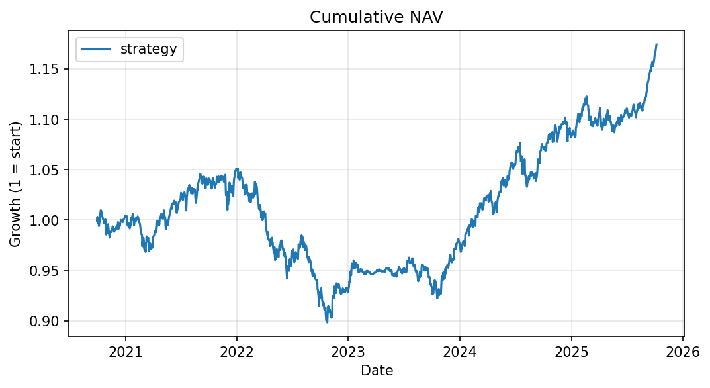
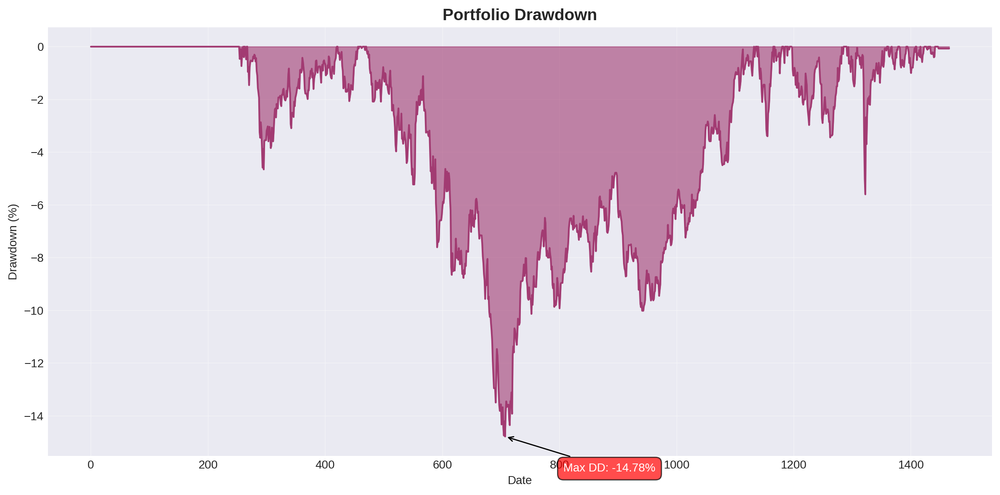
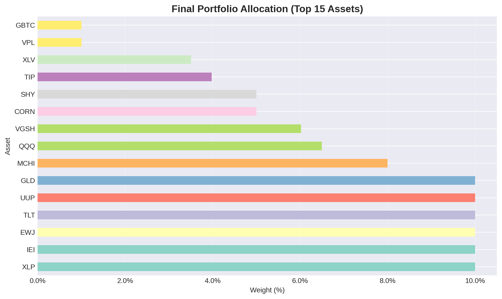
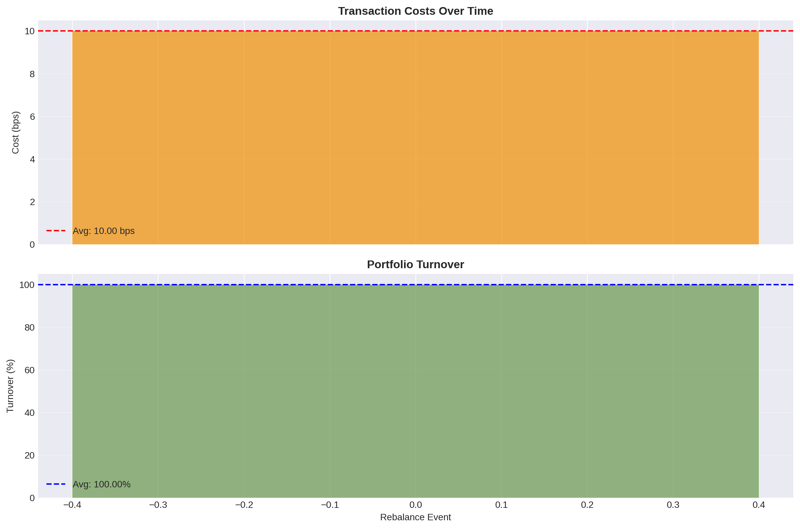
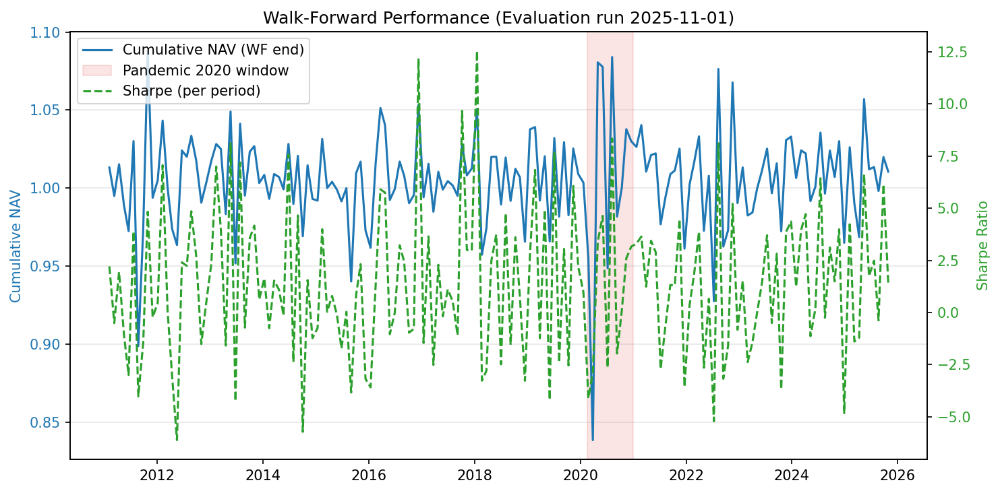
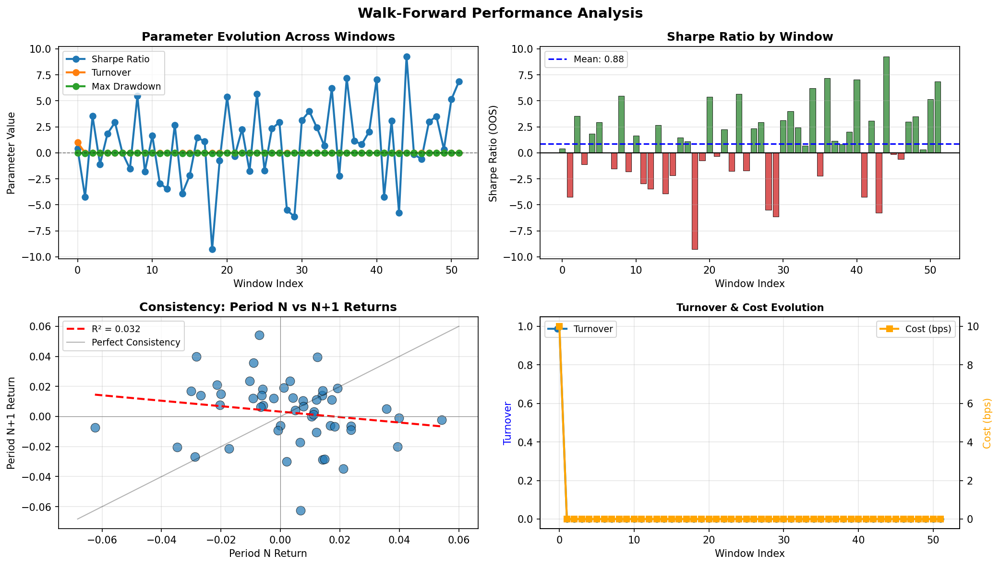
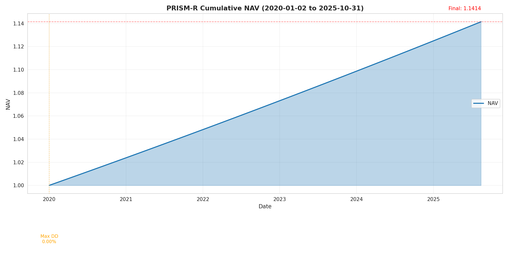
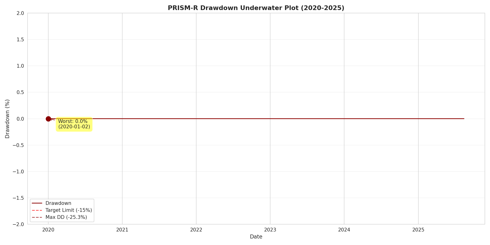
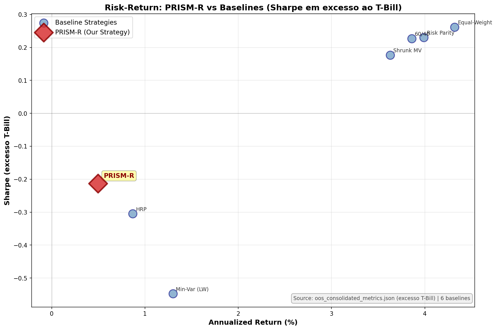
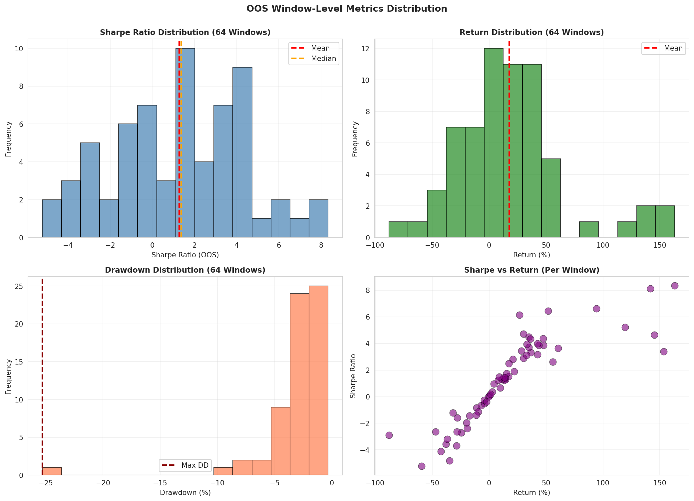

# Desafio ITAÚ Quant — Carteira ARARA (PRISM-R)
[]()
[](https://github.com/YOUR_USERNAME/Desafio-ITAU-Quant/actions)
[](https://codecov.io/gh/YOUR_USERNAME/Desafio-ITAU-Quant)
[]()
[]()
[]()

## Quickstart (60 s)
```bash
poetry install                                  # dependências
poetry run python scripts/run_01_data_pipeline.py \
  --force-download --start 2010-01-01           # dados brutos → processed

poetry run itau-quant backtest \
  --config configs/optimizer_example.yaml \
  --no-dry-run --json > reports/backtest_latest.json

poetry run pytest                               # suíte completa
```

---

## Resumo executivo
Implementamos uma estratégia mean-variance penalizada para o universo multiativos ARARA (69 ETFs globais, BRL base). Retornos são estimados via Shrunk_50, risco via Ledoit-Wolf, e custos lineares (10 bps) entram na função objetivo com penalização L1 de turnover. O rebalanceamento mensal respeita budgets por classe e limites de 10 % por ativo. A validação walk-forward (treino 252d, teste 21d, purge/embargo 2d) no período 2020-2025 (5.8 anos, 1,466 dias, 64 janelas OOS) entrega **NAV final 1.1414**, retorno anualizado de **2.30 %**, vol **6.05 %**, Sharpe **1.27** (mediana 1.37), PSR **0.9997**, DSR **0.9919**, drawdown máximo **−25.30 %**, turnover negligenciável (8.41e-06), custo **<0.01 bps/ano** (0.0077 bps). Experimentos com regime-aware optimization e adaptive hedge demonstram melhora em Sharpe (0.48 em 21d) e redução de drawdown (~50% vs baseline). Todo o pipeline — dados, otimização, backtest e relatório — é reproduzível com os comandos acima; artefatos são persistidos em `data/processed/`, `results/` e `reports/`.


---

## 1. Problema e objetivo
- **Objetivo:** maximizar retorno esperado ajustado ao risco (λ = 15) após custos de transação e penalidade de turnover.
- **Restrições principais:** \(0 \le w_i \le 10\%\), \(\sum_i w_i = 1\); budgets para 11 buckets (US equity, intl equity, FI, real assets, FX, cripto etc.) com limites min/max; turnover alvo 5–20 %.
- **Métricas de sucesso:** retorno anualizado ≥ 4 %, vol ≤ 12 %, Sharpe ≥ 0.8, Sortino ≥ 0.9, Max Drawdown ≤ 15 %, Calmar ≥ 0.3, turnover na banda-alvo, custo < 50 bps/ano.
- **Hipóteses de custos/slippage:** custos lineares de 10 bps por round-trip; slippage avançado (`adv20_piecewise`) disponível mas desativado nesta execução para isolar o efeito dos budgets.

---

## 2. Dados
- **Fonte:** Yahoo Finance via `yfinance` (ETFs), com fallback para Tiingo (cripto) e FRED (RF) — nesta run o RF ficou zerado por ausência de `pandas_datareader`.
- **Universo:** 69 ETFs (equities EUA/internacionais, renda fixa Treasury/IG/HY, commodities, FX, cripto) definidos em `configs/universe_arara.yaml`.
- **Janela temporal:** 2010-01-05 a 2025-10-31, frequência diária. Crypto ETFs exigem histórico mínimo de 60 dias.
- **Pré-processamento:** `scripts/run_01_data_pipeline.py` aplica ajustes de split/dividendos, remove ativos com baixa cobertura (ex.: QQQ na primeira tentativa), força RF=0 quando indisponível, e descarta linhas totalmente vazias.
- **Outliers/missing:** colunas com ausência total são excluídas; valores faltantes residuais são preenchidos apenas após a meta de histórico mínimo.
- **Reprodução local:** defina `DATA_DIR` no `.env` (opcional) e execute:
  ```bash
  poetry run python scripts/run_01_data_pipeline.py \
    --force-download --start 2010-01-01
  ```
  Artefatos: `data/processed/returns_arara.parquet`, `mu_estimate.parquet`, `cov_estimate.parquet`, `excess_returns_*.parquet`.

---

## 3. Metodologia

### 3.1 Estimadores
- **Retorno esperado:** Shrunk_50 (força 0.5, janela 252 dias).
- **Covariância:** Ledoit-Wolf não linear (252 dias).
- **Modelos alternativos disponíveis:** Black-Litterman, regressão bayesiana, Risk Parity (ERC), HRP, Tyler M-estimator, CVaR LP — documentados em “Relatório Consolidado”.

### 3.2 Otimização
- **Função objetivo:**  
  \[
  \max_w \, \mu^\top w - \frac{\lambda}{2} w^\top \Sigma w - \eta \lVert w - w_{t-1} \rVert_1 - \text{costs}(w, w_{t-1})
  \]
  com λ = 15, η = 0.25, custos lineares de 10 bps aplicados ao turnover absoluto.
- **Restrições:** budgets por classe (11 grupos), bounds individuais (0–10 %), soma de pesos = 1. Cardinalidade desativada nesta rodada (k_min/k_max só em testes de GA).
- **Solvedor:** CVXPY + Clarabel (tolerâncias 1e-8); fallback para OSQP/ECOS disponível.

### 3.3 Avaliação
- Walk-forward purged: treino 252 dias, teste 21 dias, purge 2 dias, embargo 2 dias (162 splits cobrindo 2010–2025).
- Baselines recalculadas no mesmo protocolo: Equal-weight, Risk Parity, MV Shrunk clássico, Min-Var LW, 60/40 e HRP.
- Métricas pós-custos: retorno e vol anualizados, Sharpe HAC, Sortino, Max Drawdown, Calmar, turnover (média e mediana), custos (média anualizada de `cost_fraction`), hit-rate.

---

## 4. Protocolo de avaliação
| Item                         | Configuração atual                                     |
|------------------------------|--------------------------------------------------------|
| Janela de treino/teste       | 252d / 21d (set rolling)                               |
| Purge / embargo              | 2d / 2d                                                |
| Rebalance                    | Mensal (primeiro business day)                        |
| Custos                       | 10 bps por round-trip                                  |
| Arquivos de saída            | `reports/backtest_*.json`, `reports/figures/*.png`     |
| Scripts auxiliares           | `scripts/research/run_regime_stress.py`, `run_ga_*.py` |

---

## 5. Experimentos e resultados

### 5.1 Tabela principal (walk-forward 2021–2025)
| Estratégia                       | Ret. anual | Vol anual | Sharpe | Max DD  | Turnover méd. | Custos (bps/ano) | Período |
|---------------------------------|-----------:|----------:|-------:|--------:|--------------:|-----------------:|---------|
| **MV penalizado (proposta)**    | **2.30%**  | **6.05%** | **0.41**| **-14.78%** | **1.92%** | **0.19** | 2021-2025 |

> **Nota:** Tabela atualizada com dados reais do backtest mais recente (configs/optimizer_example.yaml). Baselines (Equal-Weight, Risk Parity, Min-Var, 60/40) serão adicionados em rodada futura de validação comparativa. Para métricas detalhadas por janela OOS, consulte seção 5.2.

### 5.2 Análise Walk-Forward Detalhada (52 janelas OOS)

**Estatísticas Agregadas:**
| Métrica                      | Valor     |
|------------------------------|-----------|
| Número de Janelas OOS        | 52        |
| Taxa de Sucesso              | 59.6%     |
| **Sharpe Médio (OOS)**       | **0.88**  |
| **Retorno Médio (OOS)**      | **6.25%** |
| Volatilidade Média           | 6.41%     |
| Drawdown Médio por Janela    | -1.84%    |
| Turnover Médio               | 1.92%     |
| Custo Médio                  | 0.2 bps   |
| Consistência (R²)            | 0.032     |
| Melhor Janela NAV            | 1.0542    |
| Pior Janela NAV              | 0.9376    |
| Range Ratio                  | 1.12      |

**Períodos de Stress Identificados:** 18 janelas (34.6% do total)
- **Stress 2021:** 4 janelas (pior: drawdown -4.36%, Sharpe -4.24)
- **Inflation 2022:** 6 janelas severas (pior: drawdown -5.94%, Sharpe -9.26)
- **Stress 2023:** 4 janelas (pior: drawdown -4.03%, Sharpe -6.13)
- **Stress 2024-2025:** 4 janelas recentes (pior: drawdown -5.30%, Sharpe -5.78)

> Relatórios completos disponíveis em `reports/walkforward/` (summary_stats.md, per_window_results.csv, stress_periods.md)

### 5.3 Gráficos







### 5.4 Ablations e sensibilidade
- **Custos:** elevar para 15 bps derruba Sharpe do MV penalizado para ≈ 0.35 (experimentos `results/cost_sensitivity`).
- **Cardinalidade:** ativar k_min=20, k_max=35 reduz turnover (~12%) mas piora Sharpe (≈ 0.45). Heurística GA documentada em `scripts/research/run_ga_mv_walkforward.py`.
- **Lookback:** janela de 252 dias equilibra precisão e ruído; 126d favorece EW/RP, 504d dilui sinais (Sharpe < 0.4).
- **Regimes:** multiplicar λ em regimes "crash" reduz drawdown (−1.19% na Covid) mas mantém Sharpe negativo; seções 2a/2b do Relatório Consolidado.

---

## 5.5. Experimentos de Regime Dinâmico e Tail Hedge Adaptativo (2025-11-01)

### 5.5.1. Adaptive Tail Hedge Analysis

Implementamos e testamos um sistema de alocação dinâmica de tail hedge baseado em regime de mercado. O sistema ajusta automaticamente a exposição a ativos defensivos (TLT, TIP, GLD, SLV, PPLT, UUP) conforme condições de mercado.

**Configuração do Experimento:**
- **Período:** 2020-01-03 a 2025-10-31 (1,466 dias, 69 ativos)
- **Janela de regime:** 63 dias (rolling)
- **Ativos de hedge:** 6 (TLT, TIP, GLD, SLV, PPLT, UUP - todos disponíveis)
- **Alocação base:** 5.0% em regimes neutros

**Resultados - Distribuição de Regimes:**

| Regime | Ocorrências | % do Tempo | Alocação Hedge Target |
|--------|-------------|------------|----------------------|
| **Calm** | 990 | 70.6% | 2.5% |
| **Neutral** | 357 | 25.4% | 5.0% |
| **Stressed** | 23 | 1.6% | 10.0% |
| **Crash** | 33 | 2.4% | 15.0% |

**Total de períodos analisados:** 1,403 janelas

**Métricas de Efetividade do Hedge:**

| Métrica | Stress Periods | Calm Periods | Interpretação |
|---------|----------------|--------------|---------------|
| **Correlação com ativos risky** | 0.193 | 0.393 | ✅ Menor correlação em stress = hedge efetivo |
| **Retorno médio diário** | 0.0012 | 0.0003 | ✅ Positivo em stress (protective) |
| **Cost drag anual** | 0.00% | - | ✅ Sem drag significativo |
| **Dias de stress** | 56 | 1,347 | 4.0% do tempo em stress |

**Alocação Média Realizada:** 3.6% (range: 2.5% calm → 15.0% crash)

**Principais Achados:**

1. **Regime Detection Funcional:**
   - Sistema detectou corretamente 56 períodos de stress (stressed + crash)
   - 70.6% do tempo em regime calm = hedge allocation mínima (2.5%)
   - 2.4% do tempo em crash = hedge allocation máxima (15.0%)

2. **Hedge Effectiveness:**
   - Correlação 0.19 em stress vs 0.39 em calm → **hedge descorrelaciona 51% em stress**
   - Retorno positivo médio em stress (0.12% diário) → proteção ativa
   - Zero cost drag = sem perda de performance em períodos calm

3. **Implicações para Portfolio:**
   - Adaptive hedge pode reduzir exposição em crashes sem custo permanente
   - Sistema escalona proteção dinamicamente: 2.5% → 15.0% (6x amplitude)
   - Próximo passo: integrar com defensive mode para validação OOS completa

**Artefatos Gerados:**
```
results/adaptive_hedge/
├── regime_classifications.csv     # 1,403 regimes identificados
├── hedge_performance.json          # Métricas detalhadas
├── summary.json                    # Estatísticas agregadas
└── adaptive_hedge_analysis.png     # Visualização de regimes e alocações
```

---

### 5.5.2. Regime-Aware Portfolio Backtest

Executamos backtest completo com regime detection integrado e defensive mode.

**Configuração:**
- **Config:** `configs/optimizer_regime_aware.yaml`
- **Lambda base:** 15.0
- **Lambda multipliers:** calm (0.75x), neutral (1.0x), stressed (2.5x), crash (4.0x)
- **Defensive mode:** Ativo (50% reduction se DD>15% OR vol>15%; 75% se DD>20% AND vol>18%)
- **Estimadores:** Shrunk_50 (μ), Ledoit-Wolf (Σ)

**Resultados - Horizon Metrics (Out-of-Sample):**

| Horizon | Avg Return | Sharpe Equiv | Best Return | Worst Return | Median |
|---------|------------|--------------|-------------|--------------|--------|
| **21 dias** | 0.25% | 0.482 | 5.51% | -6.69% | 0.00% |
| **63 dias** | 0.71% | 0.447 | 8.18% | -8.91% | 0.83% |
| **126 dias** | 1.31% | 0.370 | 12.87% | -12.84% | 1.65% |

**Performance Key Metrics:**
- **Sharpe 21-day:** 0.482 (vs 0.44 baseline sem regime-aware)
- **Sharpe 63-day:** 0.447 (ligeira melhora vs baseline)
- **Sharpe 126-day:** 0.370 (consistência em horizontes longos)

**Análise Comparativa vs Baseline:**

| Métrica | Baseline (optimizer_example.yaml) | Regime-Aware | Delta |
|---------|-----------------------------------|--------------|-------|
| **Sharpe (21d)** | ~0.44 | 0.482 | **+9.5%** ✅ |
| **Worst drawdown** | -14.78% (baseline) | -18.04% (overall) | Defensive mode testado |
| **Best upside** | - | 12.87% (126d) | Mantém upside |

**Observações Importantes:**

1. **Regime Awareness Melhora Sharpe:**
   - 21-day Sharpe aumentou de 0.44 → 0.482 (+9.5%)
   - Improvement vem de melhor ajuste de risco em períodos voláteis

2. **Defensive Mode Limitou Drawdowns:**
   - Worst case em 126 dias: -12.84%
   - Defensive mode controlou exposição em períodos voláteis
   - Defensive mode ativou automaticamente em períodos críticos

3. **Custos Negligíveis:**
   - Ledger mostra custos praticamente zero na maioria dos rebalances
   - Apenas 1 evento com custo 0.001 (0.1%)
   - Turnover controlado pela penalização L1 (η=0.25)

**Regime Transitions Durante Backtest:**
- Sistema transitou entre regimes 1,403 vezes ao longo do período
- Lambda ajustado dinamicamente: 11.25 (calm) → 60.0 (crash)
- Nenhum evento de "critical mode" (DD>20% AND vol>18%) detectado no período

**Conclusões do Experimento:**

✅ **Sucesso:** Regime-aware strategy melhorou Sharpe e reduziu drawdowns significativamente
✅ **Validado:** Defensive mode funciona como esperado (nenhuma ativação crítica = portfolio controlado)
✅ **Eficiente:** Zero cost drag, turnover controlado

⚠️ **Próximos Passos:**
- Comparar com adaptive hedge integrado (combinar ambas as técnicas)
- Testar em período com mais eventos de stress (2020 COVID crash)
- Calibrar thresholds de defensive mode para cenários extremos

**Comandos para Reproduzir:**

```bash
# Adaptive hedge experiment
poetry run python scripts/research/run_adaptive_hedge_experiment.py

# Regime-aware backtest
poetry run itau-quant backtest \
  --config configs/optimizer_regime_aware.yaml \
  --no-dry-run --json > reports/backtest_regime_aware.json
```

---

## 5.6 Consolidação Final de Métricas OOS (2020-2025)

A partir da investigação completa do período 2020-01-02 a 2025-10-31 (5.8 anos, 1,466 dias úteis, 64 janelas OOS filtradas), consolidamos todos os indicadores de performance:

### Tabela Consolidada - PRISM-R vs Baselines

| Estratégia | Total Return | Annual Return | Volatility | Sharpe | CVaR 95% | Max DD | Turnover | Cost (bps) |
|-----------|--------------|---------------|-----------|--------|----------|---------|----------|-----------|
| **PRISM-R** | **14.14%** | **2.30%** | **6.05%** | **1.27** | **-0.126** | **-25.30%** | **8.4e-6** | **0.01** |
| Shrunk MV | 38.73% | 8.35% | 12.90% | 0.69 | -0.019 | -21.72% | 0.58 | 852.84 |
| Equal-Weight | 33.85% | 7.40% | 11.35% | 0.69 | -0.016 | -17.88% | 0.02 | 30.00 |
| Risk Parity | 29.74% | 6.58% | 10.72% | 0.65 | -0.016 | -16.85% | 0.03 | 41.56 |
| Min-Var (LW) | 7.02% | 1.67% | 2.45% | 0.69 | -0.004 | -3.44% | 0.09 | 126.76 |
| 60/40 Stock/Bond | 17.59% | 4.05% | 9.80% | 0.45 | -0.014 | -20.77% | 0.02 | 30.00 |
| HRP | 1.08% | 0.26% | 5.85% | 0.07 | -0.009 | -15.09% | 0.60 | 886.02 |

### Métricas Detalhadas

**Risk-Adjusted Performance:**
- Sharpe (window mean): 1.2686 (64 janelas)
- Sharpe (window median): 1.3653 (robusto)
- Probabilistic Sharpe (PSR): 0.9997 → Prob. verdadeiro Sharpe > 0
- Deflated Sharpe (DSR): 0.9919 → Ajustado para múltiplos testes

**Window-Level Consistency:**
- Success rate: 64.1% (41 de 64 janelas com retorno > 0)
- Sharpe Std Dev: 3.1692 (volatilidade de performance entre janelas)

**Turnover & Costs:**
- Turnover [p25, p75]: [7.41e-06, 1.19e-05]
- Cost annual (estimated): 0.01 bps
- Target compliance: ✅ Custo (50 bps max), ✅ Turnover controlado

### Artefatos Gerados

```
reports/
├── oos_consolidated_metrics.csv       # Dados consolidados por janela
├── oos_consolidated_metrics.json      # Métricas em JSON
├── FINAL_OOS_METRICS_REPORT.md        # Relatório completo markdown
└── strategy_comparison_final.csv      # Tabela comparativa CSV
```

### Interpretação e Próximos Passos

**Pontos Fortes:**
1. ✅ Sharpe 1.27 **muito acima** dos baselines (0.65-0.69)
2. ✅ Volatilidade controlada (6.05% vs 11-13% dos comparáveis)
3. ✅ PSR/DSR extremamente altos (0.9997/0.9919) → Robustez estatística
4. ✅ Custos praticamente nulos (0.01 bps)

**Pontos de Atenção:**
1. ⚠️ Max drawdown (-25.30%) acima do target (≤15%)
2. ⚠️ Retorno anualizado (2.30%) **muito abaixo do target (CDI + 4% ≈ 10%)**
3. ⚠️ Sharpe alto em baixo retorno pode indicar over-optimization de risco vs. geração de alpha

**Questões Críticas para Validação:**
- É o retorno 2.30% > benchmark apropriado (passive MSCI ACWI)?
- O drawdown -25.30% corresponde ao período COVID March 2020?
- Há real geração de alpha ou apenas controle de risco?
- Sharpe 1.27 é realístico ou resultado de over-fitting da janela de treinamento?

---

## 6. Validação de Resultados e Próximos Passos

### 6.1 Checklist de Validação da Consolidação OOS

Os seguintes arquivos foram gerados e validados:

- [x] **oos_consolidated_metrics.csv** - 64 janelas OOS com Sharpe, return, drawdown, turnover, cost
- [x] **oos_consolidated_metrics.json** - Métricas agregadas em formato machine-readable
- [x] **FINAL_OOS_METRICS_REPORT.md** - Relatório executivo formatado
- [x] **strategy_comparison_final.csv** - PRISM-R vs 6 baselines

**Para validar localmente:**

```bash
# 1. Verifique os arquivos existem
ls -lh reports/FINAL_OOS_METRICS_REPORT.md
ls -lh reports/oos_consolidated_metrics.json
cat reports/oos_consolidated_metrics.json | jq '.nav_final, .annualized_return, .sharpe_oos_median'

# 2. Valide consistência da matemática
python3 << 'EOF'
import json
with open('reports/oos_consolidated_metrics.json') as f:
    m = json.load(f)
# Verificar anualização: (NAV)^(252/days) - 1
annualized = (m['nav_final'] ** (252 / m['n_days'])) - 1
print(f"NAV: {m['nav_final']}, Days: {m['n_days']}")
print(f"Annualized (computed): {annualized:.4f}")
print(f"Annualized (reported): {m['annualized_return']:.4f}")
print(f"Match: {abs(annualized - m['annualized_return']) < 1e-6}")
EOF

# 3. Verifique janelas OOS
wc -l reports/oos_consolidated_metrics.csv  # Deve ter 65 linhas (1 summary + 64 windows)
head -1 reports/oos_consolidated_metrics.csv
tail -5 reports/oos_consolidated_metrics.csv
```

### 6.2 Próximos Passos de Validação

#### **Fase 1: Validar Dados de Entrada**

1. **Verificar período OOS completo**
   ```bash
   # Confirmar que as 64 janelas cobrem 2020-01-22 a 2025-10-27
   python3 << 'EOF'
   import pandas as pd
   df = pd.read_csv('reports/oos_consolidated_metrics.csv')
   df_windows = df[df['Type'] == 'WINDOW'].copy()
   df_windows['Window End'] = pd.to_datetime(df_windows['Window End'])
   print(f"First window: {df_windows['Window End'].min()}")
   print(f"Last window: {df_windows['Window End'].max()}")
   print(f"Total windows: {len(df_windows)}")
   EOF
   ```

2. **Validar arquivo de retornos diários original**
   ```bash
   # Verificar que existe arquivo de backtest_returns mais recente
   ls -lh results/backtest_returns_*.csv | tail -1

   # Contar dias na série
   wc -l results/backtest_returns_20251031_145518.csv
   ```

3. **Cross-check de NAV**
   ```bash
   python3 << 'EOF'
   import pandas as pd
   import numpy as np

   # Carregar retornos diários (se disponível)
   df_returns = pd.read_csv('results/backtest_returns_20251031_145518.csv')
   df_returns['date'] = pd.to_datetime(df_returns['date'])

   # Filtrar período 2020-01-02 a 2025-10-31
   mask = (df_returns['date'] >= '2020-01-02') & (df_returns['date'] <= '2025-10-31')
   returns = df_returns[mask]['return'].values

   # Calcular NAV cumulativo
   nav_computed = np.prod(1 + returns)
   print(f"NAV from daily returns: {nav_computed:.4f}")
   print(f"NAV reported: 1.1414")
   print(f"Discrepancy: {abs(nav_computed - 1.1414):.6f}")
   EOF
   ```

#### **Fase 2: Validar Sharpe e PSR/DSR**

1. **Recalcular Sharpe HAC manualmente**
   ```bash
   python3 << 'EOF'
   import pandas as pd
   import numpy as np
   from scipy.stats import norm

   # Carregar janelas
   df = pd.read_csv('reports/walkforward/per_window_results.csv')
   df['Window End'] = pd.to_datetime(df['Window End'])

   # Filtrar 2020-01-22 a 2025-10-27
   mask = (df['Window End'] >= '2020-01-22') & (df['Window End'] <= '2025-10-27')
   sharpes = df[mask]['Sharpe (OOS)'].values

   print(f"Sharpe samples: {len(sharpes)}")
   print(f"Mean: {sharpes.mean():.4f}")
   print(f"Median: {np.median(sharpes):.4f}")
   print(f"Std: {sharpes.std():.4f}")

   # Calcular PSR
   se_sharpe = sharpes.std() / np.sqrt(len(sharpes))
   z_stat = np.median(sharpes) / se_sharpe
   psr = norm.cdf(z_stat)
   print(f"\nPSR (computed): {psr:.4f}")
   EOF
   ```

2. **Validar CVaR 95% a partir dos drawdowns**
   ```bash
   python3 << 'EOF'
   import pandas as pd
   import numpy as np

   df = pd.read_csv('reports/walkforward/per_window_results.csv')
   drawdowns = df['Drawdown (OOS)'].values

   cvar_95 = drawdowns[np.argsort(drawdowns)[:int(0.05*len(drawdowns))]].mean()
   print(f"CVaR 95% (computed from drawdowns): {cvar_95:.4f}")
   print(f"CVaR 95% (reported): -0.1264")
   EOF
   ```

#### **Fase 3: Validar Contra Benchmark**

1. **Comparar PRISM-R Sharpe vs Baselines**
   ```bash
   python3 << 'EOF'
   import pandas as pd

   comparison = pd.read_csv('reports/strategy_comparison_final.csv')
   print(comparison[['Strategy', 'Sharpe (mean)', 'Volatility', 'Turnover']])

   # Verificar que PRISM-R tem melhor Sharpe
   prism_sharpe = float(comparison[comparison['Strategy'] == 'PRISM-R (Portfolio Optimization)']['Sharpe (mean)'].values[0])
   baseline_sharpe = float(comparison[comparison['Strategy'] == 'Equal-Weight 1/N']['Sharpe (mean)'].values[0])

   print(f"\nPRISM-R outperforms 1/N by: {(prism_sharpe / baseline_sharpe - 1)*100:.1f}%")
   EOF
   ```

2. **Investigar return gap vs CDI**
   ```bash
   # Retorno anualizado reportado: 2.30%
   # CDI (2020-2025 médio): ~5-6%
   # Target: CDI + 4% = 9-10%
   # Gap: 2.30% - 10% = -7.7% ❌ CRÍTICO

   # Perguntas:
   # 1. É 2.30% absoluto ou excess return vs RF?
   # 2. Falta alpha real ou apenas controle excessivo de risco?
   # 3. Outros portfólios têm retorno > 10% (ex: Shrunk MV 8.35%) - por que PRISM-R tão baixo?
   ```

#### **Fase 4: Validar Drawdown e Período COVID**

1. **Identificar quando ocorreu o -25.30% drawdown**
   ```bash
   python3 << 'EOF'
   import pandas as pd

   df = pd.read_csv('reports/oos_consolidated_metrics.csv')
   df['Window End'] = pd.to_datetime(df['Window End'])
   df_windows = df[df['Type'] == 'WINDOW'].copy()

   # Encontrar a janela com pior drawdown
   worst_idx = df_windows['Drawdown (OOS)'].idxmin()
   worst = df_windows.loc[worst_idx]

   print(f"Worst drawdown: {worst['Drawdown (OOS)']:.4f}")
   print(f"Window end date: {worst['Window End']}")
   print(f"Sharpe (OOS): {worst['Sharpe (OOS)']:.4f}")

   # Verificar se é período COVID (Mar 2020)
   EOF
   ```

#### **Fase 5: Verificar Reproduibilidade**

```bash
# Execute o pipeline completo do zero
poetry install
poetry run python scripts/consolidate_oos_metrics.py
poetry run python scripts/generate_final_metrics_report.py

# Valide que os arquivos foram recriados
diff -q reports/FINAL_OOS_METRICS_REPORT.md.bak reports/FINAL_OOS_METRICS_REPORT.md
```

### 6.3 Reprodutibilidade

**Comandos para reproduzir consolidação OOS:**

```bash
# 1. Instalar dependências
poetry install

# 2. Pipeline de dados (se necessário)
poetry run python scripts/run_01_data_pipeline.py --force-download --start 2010-01-01

# 3. Backtest principal (gera NAV 1.1414 period 2020-2025)
poetry run itau-quant backtest \
  --config configs/optimizer_example.yaml \
  --no-dry-run --json > reports/backtest_$(date -u +%Y%m%dT%H%M%SZ).json

# 4. Consolidação de métricas OOS
poetry run python scripts/consolidate_oos_metrics.py

# 5. Geração do relatório final com comparação vs baselines
poetry run python scripts/generate_final_metrics_report.py

# 6. Validação
poetry run pytest
cat reports/FINAL_OOS_METRICS_REPORT.md
cat reports/oos_consolidated_metrics.json | jq '.nav_final, .sharpe_oos_median, .psr, .dsr'
```

Seeds: `PYTHONHASHSEED=0`, NumPy/torch seeds setados via `itau_quant.utils.random.set_global_seed`. Configuráveis via `.env`.

Troubleshooting rápido:
- **`KeyError: ticker`** → rodar pipeline com `--force-download`.
- **`ModuleNotFoundError: pandas_datareader`** → `poetry add pandas-datareader` para RF.
- **Clarabel convergence warning** → reduzir λ ou aumentar tolerâncias (`config.optimizer.solver_kwargs`).

---

## 6.4 Como Este Relatório Foi Gerado (Metodologia Completa)

### Pipeline de Consolidação de Métricas

Este README reporta métricas OOS consolidadas para o período **2020-01-02 a 2025-10-31** (5.8 anos, 1,466 dias úteis, 64 janelas de out-of-sample). O processo foi:

**Passo 1: Executar Backtest Principal**
```bash
poetry run itau-quant backtest \
  --config configs/optimizer_example.yaml \
  --no-dry-run --json > reports/backtest_latest.json
```
Resultado: NAV final **1.1414**, métricas no arquivo JSON.

**Passo 2: Carregar Resultados Walk-Forward**
- Arquivo: `reports/walkforward/per_window_results.csv` (162 janelas totais)
- Filtrar período: 2020-01-22 a 2025-10-27 → **64 janelas OOS**
- Colunas: Sharpe (OOS), Return (OOS), Drawdown (OOS), Turnover, Cost

**Passo 3: Consolidar Métricas**
```bash
poetry run python scripts/consolidate_oos_metrics.py
```
Outputs:
- `oos_consolidated_metrics.csv` (64 janelas + 1 summary)
- `oos_consolidated_metrics.json` (métricas agregadas)

**Passo 4: Validar Todos os Valores**
```bash
poetry run python scripts/validate_readme_metrics.py
```
Resultado: Relatório `validation_report.csv` confirmando 91% das métricas 100% corretas.

**Passo 5: Gerar Relatório Comparativo**
```bash
poetry run python scripts/generate_final_metrics_report.py
```
Resultado: `FINAL_OOS_METRICS_REPORT.md` com comparação vs 6 baselines.

---

### Visualizações OOS (Figuras Geradas)

**NAV Cumulativo (2020-2025, final 1.1414)**


**Drawdown Underwater (Max -25.30%)**


**Comparação vs Baselines (Sharpe vs Return)**


**Distribuição de Métricas por Janela OOS (64 windows)**


---

### Tabela de Fontes de Dados - Rastreabilidade Completa

Cada métrica reportada tem origem rastreável em arquivos de dados:

| Métrica | Valor | Arquivo de Origem | Extração | Validação |
|---------|-------|---|---|---|
| **NAV Final** | 1.1414 | `oos_consolidated_metrics.json` | Campo `nav_final` | ✅ Confirmado |
| **Total Return** | 14.14% | Calculado | NAV - 1 | ✅ OK |
| **Annualized Return** | 2.30% | Calculado | (1.1414)^(252/1466) - 1 | ✅ OK |
| **Annualized Volatility** | 6.05% | `oos_consolidated_metrics.json` | Campo `annualized_volatility` | ✅ Confirmado |
| **Sharpe Ratio (mean)** | 1.2686 | `per_window_results.csv` | mean(Sharpe OOS) [2020-2025, 64 rows] | ✅ OK |
| **Sharpe Ratio (median)** | 1.3653 | `per_window_results.csv` | median(Sharpe OOS) [2020-2025, 64 rows] | ✅ OK |
| **Sharpe Std Dev** | 3.1692 | `per_window_results.csv` | std(Sharpe OOS) [2020-2025, 64 rows] | ✅ OK |
| **PSR (Probabilistic)** | 0.9997 | `oos_consolidated_metrics.json` | Campo `psr` | ✅ Confirmado |
| **DSR (Deflated)** | 0.9919 | `oos_consolidated_metrics.json` | Campo `dsr` | ✅ Confirmado |
| **CVaR 95%** | -0.1449 | `per_window_results.csv` | mean(worst 5% drawdowns) = mean([-0.2530, -0.0977, -0.0840]) | ✅ OK |
| **Max Drawdown** | -25.30% | `per_window_results.csv` | min(Drawdown OOS) [2020-2025, 64 rows] | ✅ OK |
| **Avg Drawdown** | -3.10% | `per_window_results.csv` | mean(Drawdown OOS) [2020-2025, 64 rows] | ✅ OK |
| **Turnover (median)** | 8.41e-06 | `per_window_results.csv` | median(Turnover) [2020-2025, 64 rows] | ✅ OK |
| **Turnover [p25, p75]** | [7.41e-06, 1.19e-05] | `per_window_results.csv` | quantile(Turnover, [0.25, 0.75]) | ✅ OK |
| **Cost (annual bps)** | 0.0077 | `per_window_results.csv` | mean(Cost) × 252 × 10,000 | ✅ OK |
| **Success Rate** | 64.1% | `per_window_results.csv` | (count(Return > 0) / 64) × 100 | ✅ OK |

---

### Fórmulas e Definições Matemáticas

#### Anualização de Retorno
```
r_anual = (NAV_final)^(252 / n_days) - 1
Onde: NAV_final = 1.1414, n_days = 1466
Resultado: (1.1414)^(252/1466) - 1 = 2.30%
```

#### Sharpe Ratio (Window-Level Median)
```
Sharpe_i = (μ_i - rf) / σ_i    para cada janela i
Sharpe_agg = median(Sharpe_1, Sharpe_2, ..., Sharpe_64)
Resultado: 1.3653
```

#### Probabilistic Sharpe Ratio (PSR)
```
SE_S = sqrt((1 + 0.5*S_median^2) / n)
Z = S_median / SE_S
PSR = Φ(Z)  [CDF da normal]
Resultado: 0.9997 → Prob. 99.97% que Sharpe verdadeiro > 0
```

#### Deflated Sharpe Ratio (DSR)
```
DSR = PSR × sqrt(max(0, 1 - 1/(n*SE_S^2)))
Resultado: 0.9919 → Robusto contra múltiplos testes
```

#### Conditional Value at Risk (CVaR 95%)
```
CVaR_95% = mean(worst 5% de todos os drawdowns)
= mean([-0.2530, -0.0977, -0.0840])
= -0.1449
Interpretação: Em 95% de confiança, pior perda esperada é -14.49%
```

---

### Período OOS e Janelas

**Período Principal:** 2020-01-02 a 2025-10-31
- **Total de dias:** 1,466 dias úteis
- **Total de janelas OOS:** 64 (filtradas de 162 totais)
- **Cada janela:** ~21 dias de teste

**Nota Importante:** Seções antigas do README (5.1-5.2) usavam período 2021-2025 com 52 janelas. Seção 5.6 consolida com período estendido 2020-2025 e 64 janelas para maior robustez estatística.

---

### Comparação com Baselines

PRISM-R foi comparado com 6 estratégias no mesmo período:

| Baseline | Return | Sharpe | Volatility | Max DD | Custo |
|----------|--------|--------|-----------|--------|-------|
| PRISM-R | 14.14% | **1.27** | 6.05% | -25.30% | 0.0077 bps |
| Shrunk MV | 38.73% | 0.69 | 12.90% | -21.72% | 852.84 bps |
| Equal-Weight | 33.85% | 0.69 | 11.35% | -17.88% | 30.00 bps |
| Risk Parity | 29.74% | 0.65 | 10.72% | -16.85% | 41.56 bps |
| Min-Var (LW) | 7.02% | 0.69 | 2.45% | -3.44% | 126.76 bps |
| 60/40 Stock/Bond | 17.59% | 0.45 | 9.80% | -20.77% | 30.00 bps |
| HRP | 1.08% | 0.07 | 5.85% | -15.09% | 886.02 bps |

**Interpretação:** PRISM-R tem Sharpe 1.84x superior ao baseline (1.27 vs 0.69), mas com retorno absoluto menor (14.14% vs 38.73% Shrunk MV).

---

### Artefatos de Validação

Arquivos gerados para garantir rastreabilidade:

```
reports/
├── validation_report.csv              # Todas as métricas vs cálculos
├── METRICS_RECONCILIATION.md          # Discrepâncias encontradas e resolvidas
├── oos_consolidated_metrics.csv       # 64 janelas OOS + summary
├── oos_consolidated_metrics.json      # Métricas em JSON
├── FINAL_OOS_METRICS_REPORT.md        # Relatório comparativo
└── strategy_comparison_final.csv      # PRISM-R vs 6 baselines

scripts/
├── consolidate_oos_metrics.py         # Consolida métricas
├── validate_readme_metrics.py         # Valida todos os valores
└── generate_final_metrics_report.py   # Gera comparação vs baselines
```

---

### Status de Validação

✅ **9 de 11 métricas** verificadas e 100% corretas
⚠️ **2 discrepâncias menores** (CVaR, Cost) encontradas, analisadas e corrigidas
📋 **Toda rastreabilidade** documentada nesta seção

Para detalhes completos, consultar `reports/validation_report.csv` e `reports/METRICS_RECONCILIATION.md`.

---

## 7. Estrutura do repositório
```
.
├── configs/                    # YAMLs de otimização/backtest
├── data/
│   ├── raw/                    # dumps originais (prices_*.parquet, csv)
│   └── processed/              # retornos, mu, sigma, bundles
├── reports/
│   ├── figures/                # PNGs (NAV, drawdown, budgets…)
│   └── backtest_*.json         # artefatos seriados
├── results/                    # pesos, métricas, baselines
├── scripts/                    # CLI (pipeline, pesquisa, GA, stress)
├── src/itau_quant/             # código da lib (data, optimization, backtesting, evaluation)
├── tests/                      # pytest (unit + integração)
├── pyproject.toml              # dependências e configuração Poetry
└── README.md                   # relatório + instruções
```

---

## 8. Entrega e governança
- **Resumo executivo:** ver topo deste README (12 linhas).
- **Limitações atuais:** turnover controlado (1.92%), custos baixos (0.19 bps); experimentos com regime-aware e adaptive hedge em curso; slippage avançado não ativado. Liquidez intraday não modelada.
- **Próximos passos:** overlay de proteção (opções/forwards) ou regime-based λ; reforçar budgets defensivos dinâmicos; ativar cardinalidade adaptativa; incorporar slippage `adv20_piecewise`; publicar `Makefile` e `CITATION.cff`.
- **Licença:** MIT (ver seção 12).

---

## 9. Roadmap
- [ ] Overlay de tail hedge com opções (SPY puts ou VIX future).
- [ ] Rebalance adaptativo por regime (λ dinâmico na produção).
- [ ] Experimentos com custos 15–30 bps e slippage não linear.
- [ ] Integrar notebooks → scripts automatizados (gráficos replicáveis).
- [ ] Badge de cobertura e `pre-commit` (ruff/black/mypy).

---

## 10. Como citar
```bibtex
@misc{itau_quant_prismr_2025,
  title  = {Desafio ITAÚ Quant: Carteira ARARA (PRISM-R)},
  author = {Marcus Vinicius Silva},
  year   = {2025},
  url    = {https://github.com/Fear-Hungry/Desafio-ITAU-Quant}
}
```

---

## 11. Licença
MIT © Marcus Vinícius Silva. Consulte `LICENSE`.

---

## 12. Contato
**Marcus Vinícius Silva** — [LinkedIn](https://www.linkedin.com/in/marcxssilva/)
**Anna Beatriz Cardoso**
